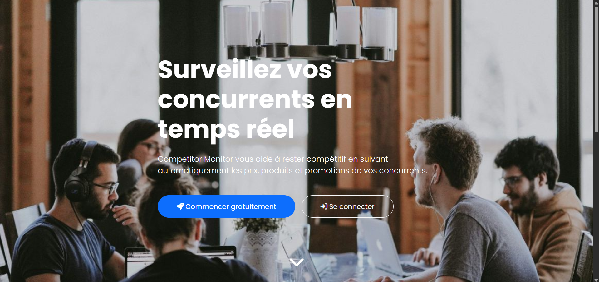
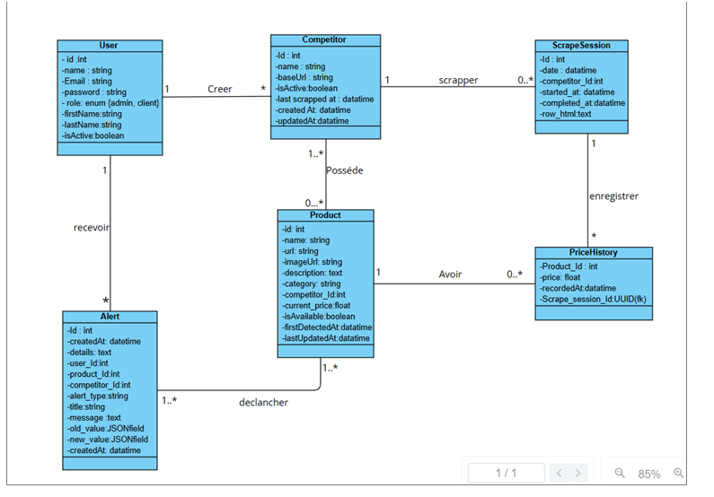
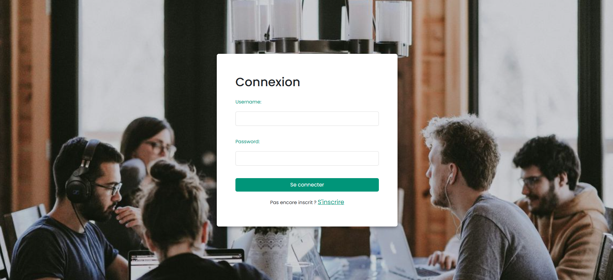
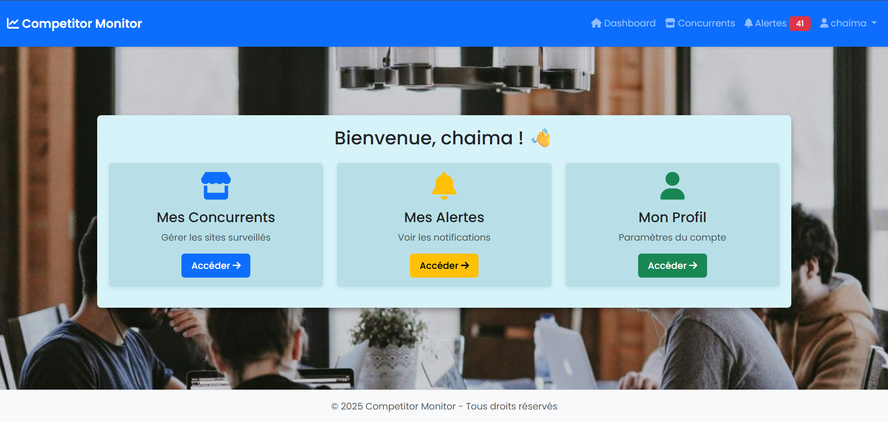
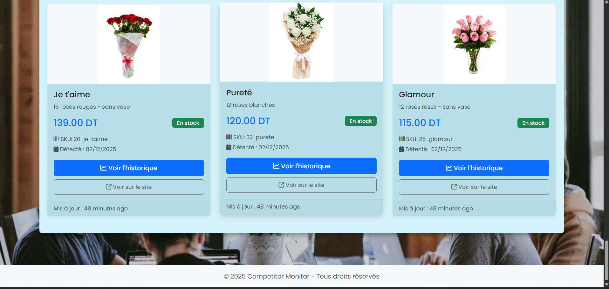
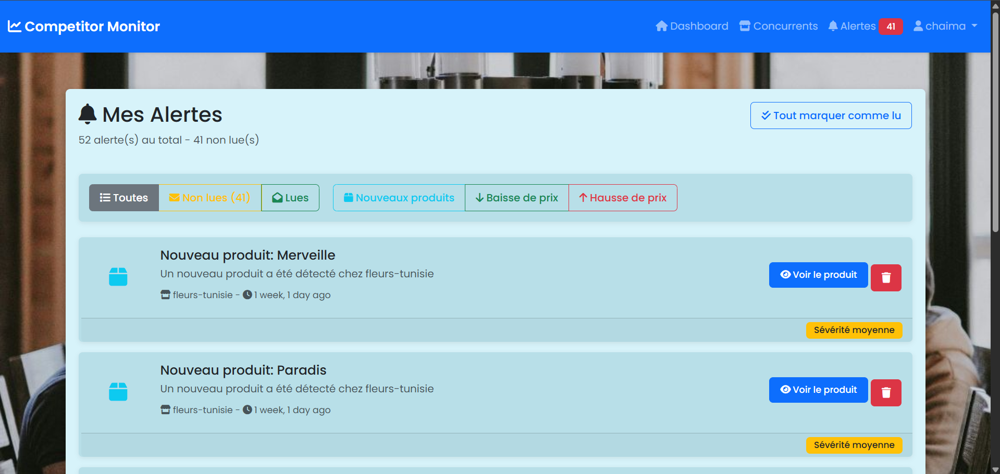
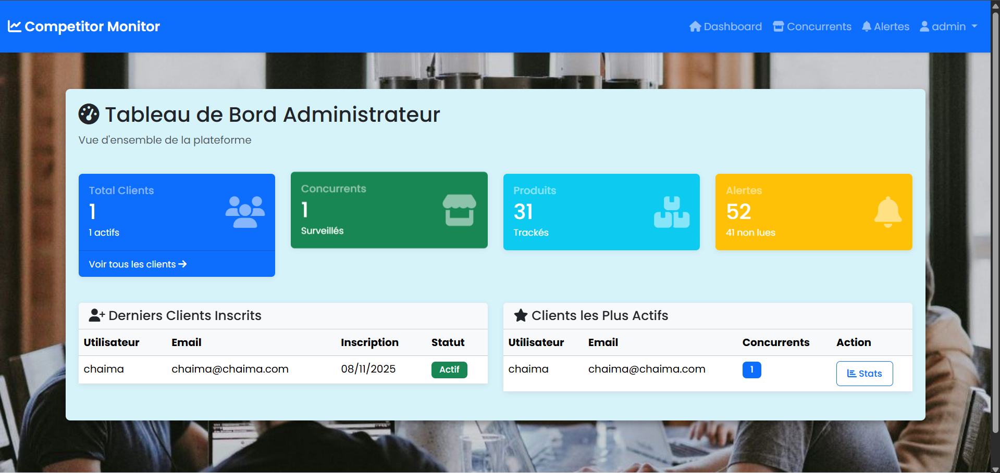

---

# 📊 Competitor Monitor

> **Intelligent web application for competitive monitoring with AI analysis**

A comprehensive solution to automatically monitor competitor e-commerce websites, detect price changes and new products using artificial intelligence.


---

## 📑 Table of Contents

- [Overview](#-overview)
- [Features](#-features)
- [Architecture](#-architecture)
- [Technologies](#-technologies)
- [Installation](#-installation)
- [Configuration](#-configuration)
- [Usage](#-usage)
- [Project Structure](#-project-structure)
- [Testing](#-testing)
- [Screenshots](#-screenshots)


---

## 🎯 Overview

**Competitor Monitor** is a Django web application designed to help businesses monitor their online competitors. The system uses intelligent web scraping coupled with a local Large Language Model (LLM) to automatically extract and analyze product data.

### Use Cases

- 🏪 **E-commerce** : Monitor competitor prices
- 📈 **Strategic Intelligence** : Detect new product launches
- 💰 **Pricing Optimization** : Receive alerts on price changes
- 🎯 **Business Intelligence** : Analyze market trends

---

## ✨ Features

### For Clients

- **🔍 Competitor Monitoring**
  - Unlimited addition of competitor websites to track
  - Manual scraping triggered on-demand
  - Overview of all competitors with statistics
- **📦 Product Management**
  - Automatic catalog of scraped products
  - Display with images, descriptions and categories
  - Complete price history with interactive charts
- **🔔 Alert System**
  - Real-time notifications for price changes (±5% minimum)
  - Alerts for newly detected products
  - Filtering by type (price increase/decrease, new products)
  - Unread alerts badge in navigation
- **📊 Data Visualization**
  - Price charts with Chart.js
  - Trends over last 30 history entries
  - Interactive statistics cards

### For Administrators

- **👥 Client Management (CRUD)**
  - Create, edit, delete accounts
  - Account activation/deactivation
  - Advanced search and filtering
- **📈 Global Statistics**
  - Platform overview
  - Most active clients
  - Recently registered clients
  - Per-client metrics
- **🔎 Detailed Analysis**
  - Per-client statistics (competitors, products, alerts)
  - Per-competitor details for each client

### Technical Features

- **🤖 AI Extraction with Ollama**
  - Local Llama 3.1 usage (no API costs)
  - Structured extraction with Pydantic validation
  - Optimized prompts for e-commerce extraction
- **🌐 Intelligent Scraping**
  - Selenium for JavaScript-heavy websites
  - BeautifulSoup for DOM cleaning
  - Error handling and automatic retry
- **💾 Optimized Database**
  - PostgreSQL with indexes for performance
  - Unlimited price history
  - Uniqueness constraints to avoid duplicates

---

## 🏗️ database_schema



### Scraping Pipeline

```
1. Selenium → HTML Retrieval (with JS)
2. BeautifulSoup → DOM Cleaning
3. Text Splitting → 7500 char batches
4. Ollama LLM → Structured JSON extraction
5. Pydantic → Data validation
6. PostgreSQL → Storage + History
7. Analysis → Price comparison → Alerts
```

---

## 🛠️ Technologies

### Backend

- **Django 5.0** - Web framework
- **Django Rest Framework** - REST API
- **PostgreSQL 15+** - Database
- **Pydantic 2.10** - Data validation

### Scraping \& AI

- **Selenium 4.18** - Browser automation
- **BeautifulSoup 4.12** - HTML parsing
- **Ollama** - Local LLM (Llama 3.1)
- **webdriver-manager** - ChromeDriver management

### Frontend

- **Bootstrap 5.3** - CSS framework
- **Chart.js 4.4** - Interactive charts
- **FontAwesome 6.4** - Icons

### Utilities

- **python-decouple** - Environment variables
- **psycopg2-binary** - PostgreSQL connector

---

## 📥 Installation

### Prerequisites

- **Python 3.10+**
- **PostgreSQL 15+**
- **Ollama** (for local LLM)
- **Google Chrome** (for Selenium)

### Step 1: Clone the Project

```bash
git clone https://github.com/wahib-bachoua/competitor-monitor.git
cd competitor-monitor
```

### Step 2: Create Virtual Environment

```bash
python -m venv venv

# Windows
venv\Scripts\activate

# Linux/Mac
source venv/bin/activate
```

### Step 3: Install Dependencies

```bash
pip install -r requirements.txt
```

### Step 4: Install Ollama and LLM Model

```bash
# Install Ollama (https://ollama.ai)
# Linux/Mac
curl -fsSL https://ollama.com/install.sh | sh

# Windows: Download from https://ollama.com/download

# Download Llama 3.1 model
ollama pull llama3.1

# Verify installation
ollama list
```

### Step 5: Configure PostgreSQL

```bash
# Connect to PostgreSQL
psql -U postgres

# Create database
CREATE DATABASE competitor_monitor_db;

# Create user (optional)
CREATE USER competitor_user WITH PASSWORD 'your_password';
GRANT ALL PRIVILEGES ON DATABASE competitor_monitor_db TO competitor_user;

\q
```

---

## ⚙️ Configuration

### `.env` File

Create a `.env` file at project root:

```env
# Database
DB_NAME=competitor_monitor_db
DB_USER=postgres
DB_PASSWORD=your_password
DB_HOST=localhost
DB_PORT=5432

# Django
DEBUG=True
SECRET_KEY=your-very-long-random-django-secret-key

# Optional
ALLOWED_HOSTS=localhost,127.0.0.1
```

### Generate SECRET_KEY

```bash
python -c "from django.core.management.utils import get_random_secret_key; print(get_random_secret_key())"
```

### Migrations

```bash
# Create migrations
python manage.py makemigrations

# Apply migrations
python manage.py migrate
```

### Create Superuser

```bash
python manage.py createsuperuser
```

Follow the prompts to create your admin account.

---

## 🚀 Usage

### Start the Server

```bash
# Launch Ollama (in separate terminal)
ollama serve

# Launch Django
python manage.py runserver
```

Access the application: **http://127.0.0.1:8000**

### Client Workflow

1. **Sign Up/Login**
   - Create a client account or log in
2. **Add a Competitor**
   - Click "Add competitor"
   - Enter name and website URL (e.g., https://www.example-shop.com)
3. **Launch Scraping**
   - Click the green 🔽 (Download) button on competitor row
   - Wait for scraping to complete (may take 1-3 minutes)
4. **View Products**
   - Click the blue badge showing product count
   - Explore detected products with images and prices
5. **Analyze Prices**
   - After a 2nd scraping, click the yellow 📊 (Analyze) button
   - Check generated alerts in "Alerts" section
6. **Check History**
   - Click "View history" on a product
   - Visualize price chart over time

### Administrator Workflow

1. **Admin Login**
   - Log in with your superuser account
   - Access Admin Dashboard
2. **Manage Clients**
   - View list of all clients
   - Create, edit, delete accounts
   - Activate/deactivate accounts
3. **View Statistics**
   - Global platform overview
   - Per-client statistics
   - Most active clients

---

## 📁 Project Structure

```
competitor-monitor/
│
├── auth_app/                      # Authentication application
│   ├── templates/
│   │   ├── base_auth.html        # Template for auth pages
│   │   ├── base_app.html         # Template for application
│   │   ├── connexion.html
│   │   ├── inscription.html
│   │   ├── client_dashboard.html
│   │   ├── admin_dashboard.html
│   │   └── admin/
│   │       ├── client_list.html
│   │       ├── client_form.html
│   │       ├── client_stats.html
│   │       └── client_delete_confirm.html
│   ├── forms.py                  # Auth + admin forms
│   ├── views.py                  # Auth + CRUD client views
│   ├── urls.py
│   └── context_processors.py     # Navbar alert counter
│
├── competitors/                   # Main application
│   ├── templates/competitors/
│   │   ├── competitor_list.html
│   │   ├── competitor_form.html
│   │   ├── competitor_delete_confirm.html
│   │   ├── product_list.html
│   │   └── product_detail.html
│   ├── management/commands/
│   │   └── test_price_change.py  # Test command
│   ├── models.py                 # Competitor, Product, PriceHistory, ScrapeSession
│   ├── views.py                  # CRUD + scraping triggers
│   ├── forms.py                  # CompetitorForm
│   ├── scraper.py                # Production scraping pipeline
│   ├── scraper_test.py           # Test scraping pipeline
│   ├── save_html_for_test.py     # Test utility
│   └── admin.py
│
├── alerts/                        # Alerts application
│   ├── templates/alerts/
│   │   └── alert_list.html
│   ├── models.py                 # Alert
│   ├── views.py                  # List + alert actions
│   └── urls.py
│
├── utils/                         # Reusable utilities
│   ├── dom_cleaner.py            # HTML cleaning
│   └── llm_processor.py          # Ollama LLM interface
│
├── competitor_monitor/            # Django configuration
│   ├── settings.py
│   ├── urls.py
│   ├── static/
│   │   ├── css/
│   │   │   ├── auth.css
│   │   │   └── app.css
│   │   ├── images/
│   │   │   └── login-bg.jpg
│   │   └── favicon.ico
│   └── wsgi.py
│
├── test_data/                     # Test data (optional)
│   ├── original_scrape.html
│   └── modified_scrape.html
│
├── manage.py
├── requirements.txt
├── .env                          # Environment variables
├── .gitignore
└── README.md
```

---

## 🧪 Testing

### Manual Scraping Test

```bash
python manage.py shell
```

```python
from competitors.scraper import scrape_competitor_website

# Replace with your competitor UUID
result = scrape_competitor_website('competitor-uuid')
print(result)
```

### Price Change Test

```bash
# 1. Save HTML from a scraping session
python manage.py shell
>>> from competitors.save_html_for_test import save_latest_scrape_html
>>> save_latest_scrape_html('competitor-uuid')

# 2. Manually modify test_data/modified_scrape.html

# 3. Run the test
python manage.py test_price_change competitor-uuid
```

### Unit Tests (coming soon)

```bash
python manage.py test
```

---

## 📸 Screenshots

<table width="100%">
  <tr>
    <td align="center" width="50%">
      <h3>Login Page</h3>
      
    </td>
    <td align="center" width="50%">
      <h3>Client Dashboard</h3>
      
    </td>
  </tr>
  <tr>
    <td align="center" width="50%">
      <h3>Competitor List</h3>
      
    </td>
    <td align="center" width="50%">
      <h3>Product Detail</h3>
      
    </td>
  </tr>
  <tr>
    <td align="center" width="50%">
      <h3>Alerts List</h3>
      
    </td>
    <td align="center" width="50%">
      <h3>Admin Dashboard</h3>
      
    </td>
  </tr>
</table>

---

## 🎓 Academic Context

This project was developed as part of an **academic project** to demonstrate:

- AI (LLM) integration in web applications
- Ethical web scraping techniques
- MVC architecture with Django
- Relational database management
- Modern UX/UI design with Bootstrap

**Intentional Limitations:**

- No automatic scheduled scraping (Celery not used)
- Manual scraping triggered by user
- Focus on simplicity and maintainability

---

## 🔒 Legal Considerations

### Ethical Web Scraping

⚠️ **Important**: This project is designed for educational purposes. When using in production:

- Respect websites' `robots.txt` files
- Don't overload servers (delays between requests)
- Check Terms of Service of websites
- Use identifiable user-agents
- Only scrape public data

### GDPR Compliance

If collecting personal data:

- Inform users (privacy policy)
- Obtain consent
- Allow data access/deletion
- Secure stored data

---

## 🗺️ Future Roadmap

- Automatic scraping with Celery Beat
- Data export (CSV, Excel)
- Email notifications
- Public REST API
- Mobile application (React Native)
- Multi-currency support
- Multi-competitor comparison
- Generated PDF reports
- Slack/Discord integration for alerts
- Multi-tenant mode

---

<div align="center">

**⭐ If this project was helpful, please give it a star! ⭐**

Made with ❤️ by [wahib]

</div>

---
